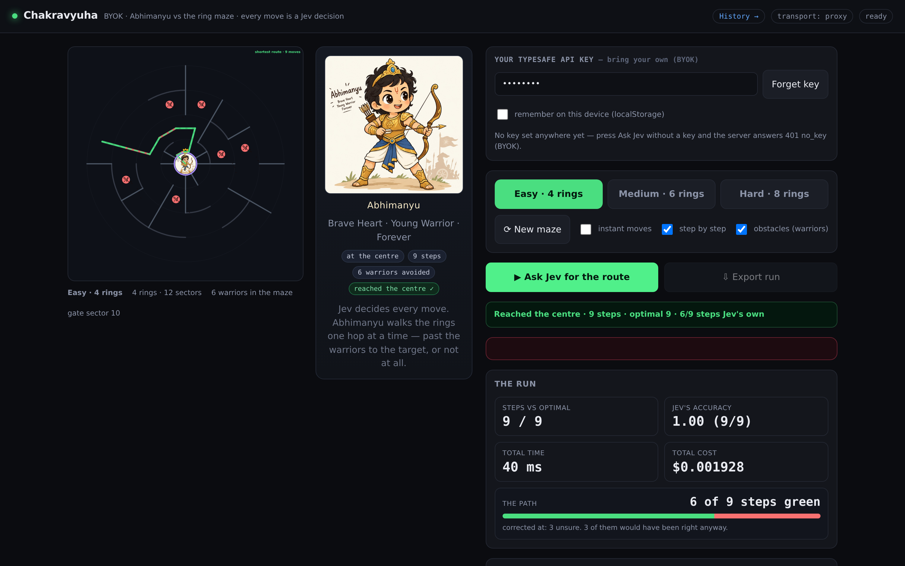
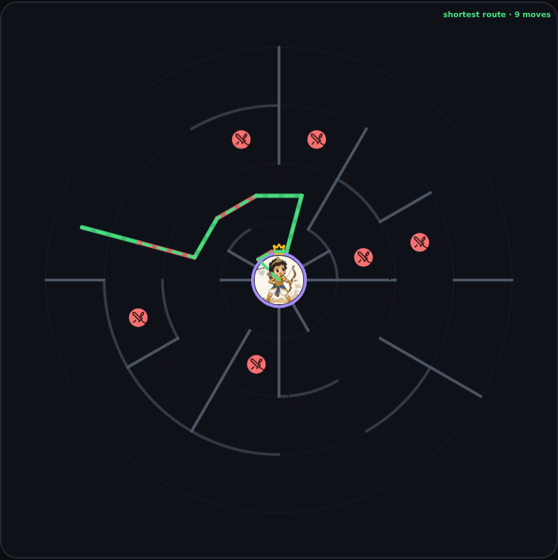
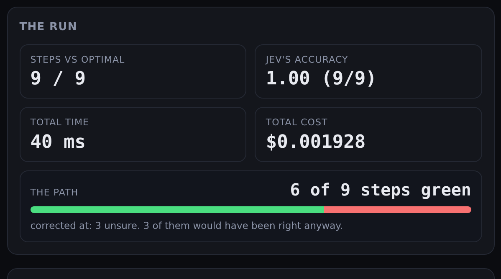
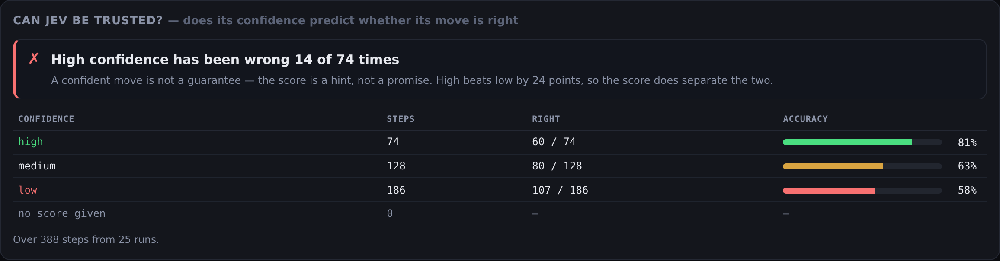

# Chakravyuha — Jev guides Abhimanyu

A browser labyrinth where **every move is a decision by Jev**. Abhimanyu starts on the
outermost ring of a *chakravyuha* — the concentric battle formation of the Mahabharata —
and has to reach the **target at the centre** past the warriors standing in the rings.

The maze is serialised to text, sent to Jev as a set of typed questions, and the move Jev
picks is the move that gets played. Where Jev is unsure — or answers with something that
cannot be played — the walk **marks the step red, plays the correct move instead, and
carries on**. So the path is either all green or a mix of green and red, and that colour,
not the outcome, is what reports the model.



*The screenshots here are taken against a mock upstream so that rendering them spends no
API key — the app itself has no stub mode.*

## What this is

**A fun experiment.** Viswa and Sarathy (his AI) built this over a weekend to explore
[Jev](https://typesafe.ai) — TypeSafe's *System One* model — by giving it a toy it could
not bluff its way through. Two questions drove it:

1. **Can a model play a game purely through typed answers?** Not free text, not tool
   calls: a state goes in, a finite set of typed choices comes out, and the game obeys.
2. **Can its confidence score be trusted?** If a high-confidence move is always the right
   move, then the score is worth gating on. If it is not, the score is decoration — and
   that is worth knowing before anyone builds on it.

The maze is the excuse. The real output is the measurement: **green where Jev's own move
was played, red where it was overruled**, and a history page that asks whether its
confidence predicts its accuracy.

It is a toy, and it is deliberately unforgiving: a wrong move is visible on the board, and
every claim on the history page is computed from recorded runs rather than asserted.

## Green and red — the path is the measurement

Every step is graded, and the grading is the point.

| colour | meaning |
|---|---|
| 🟢 **green** | Jev's own move, played exactly as it gave it. |
| 🔴 **red** | Jev's move was **not** played. The walk took the correct move from its own calculation instead, and went on. |

A red step records *why* it was red:

- **unsure** — confidence below 0.5. Per the TypeSafe spec a low read means no clear
  winner, so it is not acted on.
- **unplayable** — the answer is not a door here, or it doubles back onto a cell already
  walked. There is nothing to play.
- **unreadable** — no usable answer for that cell at all.
- **detour** — even the correct move's cell had already been walked. The no-revisit rule
  outranks the direct route.

It also records whether Jev's own answer **would have been right anyway**. An unsure guess
that turned out correct is a different fact from a confident answer that was not, and the
two must not be averaged together.





The headline meter is **Jev's accuracy** — of the moves Jev *proposed*, how many shortened
the distance to the centre. The walk's own accuracy sits beside it in the details, and
stays at 1.0 unless a **green** step went astray: the interesting case, where the model was
confident and wrong.

## Can Jev be trusted?

The history page answers the second question directly, and it is the reason the whole
confidence capture exists.



It is computed from **Jev's own moves only**, never from what the walk played — and that
distinction is the whole trick. A red step always plays the correct move, so grading the
moves we played would score low confidence at 100% *for exactly the reason we stopped
trusting it*. The analysis would be circular, and would report the opposite of the truth.
Only Jev's own answers can say whether its confidence tracks its accuracy.

Silence is its own state: when Jev gives no usable answer it is excluded from both
numerator and denominator. Counting that as a miss would slander the score; counting it as
a hit would flatter it.

The page refuses to overclaim. A flawless record under **20 confident steps** is reported as
*suggestive, not yet conclusive* rather than reliable, and the verdict also reports whether
the score actually **separates** high confidence from low — a score that ranked high below
low would be worse than no score, and the page says so in as many words.

Current state on our own history — a snapshot, dated **2026-09-18**, over 25 runs and 388
graded steps: **high 60/74 (81%), medium 80/128 (63%), low 107/186 (58%)**. High beats low
by 24 points, so the score does separate the two rather than being noise.

But 81% is not a promise. High confidence was **wrong 14 times**. The page says so in as
many words — *"a confident move is not a guarantee; the score is a hint, not a promise"* —
and that is the honest answer to the question we started with. It is also not the answer we
were hoping for: an earlier, smaller sample showed high at 10/10 with no misses, and it
would have been easy to stop there and call the score trustworthy. More runs made the
picture worse and the write-up better.

## How a run works

```
    difficulty (easy / medium / hard) + 🎲 New maze + obstacles toggle
             │
             ▼
    state = { maze, open_radial, open_circ, warriors, abhimanyu, centre,
              visited, start, rules, objective }
             +
    questions = { cell_3_7: {…}, cell_3_8: {…}, … }   ← one typed choice per CELL:
             │        "which move is the first step of a shortest route from here?"
             ▼
    POST → /api/jev → TypeSafe → every answer in ONE forward pass
             │
             ▼
    walk from the start cell, following the policy:
        confidence < 0.5, or the move cannot be played?
            → RED  · play the correct move from our own calculation
        otherwise
            → GREEN · play Jev's move exactly as given
             │
             ▼
    Abhimanyu ANIMATES each hop, coloured as it goes
             │
             ▼
    shortest route drawn only after the run ends, to compare
             │
             ▼
    meters: steps vs optimal · Jev's accuracy · the green/red split · time · cost
             │
             ▼
    the run is recorded server-side, so history accumulates across sessions
```

**Why the whole policy in one call.** Jev answers every question in one forward pass
against a shared state, and adding questions barely moves the latency. Asking one move per
round trip made a run cost one call per move, each dependent on the last; asking about
every cell at once makes it cost **one** call, and the walk then follows the policy without
further round trips. `maxSteps = 2·R·S` remains only as a defensive guard — since a red
step always plays a correct move and no cell is ever revisited, it should never fire.

**The obstacles toggle** turns the warriors off, leaving a pure wall maze. The only thing
that can stop a run is then a wall, which separates "can Jev compute a route" from "can Jev
avoid a dead end".

**One honest limit.** The walk can still end **stuck** if a *green* step — a confident move
of Jev's own — leads into a corner, because the no-revisit rule forbids retracing. So a
path can still truncate, and when it does the card says so plainly.

## The three difficulties

| Level | Rings × sectors | Warriors | Braid |
|---|---|---|---|
| **Easy** | 4 × 12 | 6 | 0.20 |
| **Medium** | 6 × 16 | 14 | 0.12 |
| **Hard** | 8 × 20 | 26 | 0.06 |

*Braid* is the fraction of still-closed walls re-opened after the maze is carved, so the
maze keeps loops and several routes exist. Every maze is guaranteed solvable and deep enough
to be worth asking about: generation carves a **randomised DFS spanning tree** over centre
+R×S cells on a polar grid, then braids it, then places warriors one at a time, rejecting
any placement that would sever the route to the centre. A fresh maze is redrawn until the
shortest route is at least `minSteps` long and the warrior count is exact.
`test/chakra.test.mjs` proves this over 200 seeded draws per level.

## Quickstart

```bash
cd ~/ws/jev/chakravyuha-jev
npm start                 # http://localhost:8787
```

Zero dependencies — Node ≥ 20 only (it uses global `fetch`). There is **no stub mode**:
without a key the shim answers `401 no_key` and the page tells you to paste one. The app
is LIVE-only, by design.

## Bring your own key (BYOK)

TypeSafe blocks browser-to-API calls: the live endpoint answers OPTIONS preflights with
`400` and **no `Access-Control-Allow-Origin` header**, so a key used directly in the page
cannot reach the API. The same-origin **shim** relays instead:

1. Paste your key into the **keycard** (whitespace trimmed; never logged, never sent
   anywhere but the shim, never committed, never returned in a response).
2. Tick **remember** to keep it in `localStorage` (`jev.key`); **Forget key** clears it.
3. The badge reads **LIVE** once a request succeeds, **NO KEY** otherwise.

A key in the page takes priority over a server-side env key for that request only.

```bash
TYPESAFE_API_KEY=sk_... npm start    # a server-side key, if you prefer it out of the browser
TYPESAFE_MODEL=jev-latest npm start  # optional model override
```

## The animation

Abhimanyu **travels** the maze; he does not teleport. Each applied move tweens him between
cell centres in **polar** space, so he sweeps along a ring rather than cutting a chord, and
a `S-1 → 0` wrap takes the short way round instead of spinning the long way. He faces the
direction of travel, and lands on the target with a sparkles flare.

The path is drawn **segment by segment**, so each hop carries its own colour — green where
Jev's move was played, red where the walk overruled it. The colour is decided at the moment
of the step and travels with it, so the picture cannot drift from the numbers.

Two rules keep it honest:

- **The animation never reveals a route Jev has not chosen.** During a run the sprite
  animates exactly the hop that was decided. Feeding it the shortest route would leak the
  answer into the render layer. `test/animation.test.mjs` drives a deliberately wandering
  policy and asserts the sprite walked *that* route, not the shortest.
- **The shortest route appears only after the run ends**, as a dashed line labelled
  *"shortest route · N moves"*, so the steps-vs-optimal meter has a picture to compare
  against.

Movement is queue-based and cancellable, and `prefers-reduced-motion` (or `?anim=0`, or
`setAnimationDuration(0)`) snaps between cells for accessibility and deterministic tests.

## Icons

`lucide-react` needs React and a build step; this is a zero-dependency static ES-module
page. So the **exact Lucide geometry** (`lucide-static` v1.47.0, **ISC licence**) is
vendored in `lib/icons.js` as path data and drawn on canvas via `Path2D`. No CDN is
contacted at runtime. The `target` glyph marks the goal at the centre, `crown` badges
Abhimanyu, `swords` marks warrior dots when they are large enough, and `sparkles` fires on
arrival.

## Where the route is known, and where it is not

`lib/chakra.js` holds the only search in the codebase. It is used in two places:

- by the shell **after a run ends**, to compute the optimal route for the comparison
  overlay, and by maze generation to verify solvability;
- by the walk, through `referenceMove()` and `distanceToGoal()` — **one local step** of
  ground truth, so it can overrule a move it will not play.

The invariant is no longer "the game loop never knows the route". It is the stronger and
more useful rule: **the walk may know the next correct move, but never the route.** If it
held the whole path it could replay it, and "the model's own move" would stop meaning
anything — the green/red split would measure nothing. `test/static.test.mjs` enforces
exactly this: no `optimalRoute`, not even the raw search, only the local helpers.

## Metrics — how long, and how correct

Every completed run is recorded **server-side** into `runs.jsonl` (one JSON object per
line, append-only, capped at the most recent **500**, git-ignored) — so history survives a
browser change and is visible from any device. The client computes the meters; the server
only whitelists fields, clamps numbers, drops credential-shaped keys, **rejects any record
whose mode is not one of the two live modes**, and stamps `id`/`at`. Recording is
fire-and-forget and never alters the play flow's response.

On the play page:

| Meter | Definition |
|---|---|
| steps vs optimal | `steps / optimal`, where `optimal` is the shortest route's length |
| **Jev's accuracy** | **of the moves Jev proposed, the fraction that reduced the distance to the centre by exactly 1** |
| total time | the sum over every call |
| total cost | `$`, summed from every call |
| the path | green steps / total, with the reasons for each red step |
| decision time · last step | the last call's wall time |
| calls made | round trips to Jev |
| policy used · applied / answered | steps taken / answers Jev returned |
| walk accuracy | the moves **played** that shortened the distance by 1 — 1.0 unless a green step went astray |
| elapsed | wall-clock time for the whole run |

And an **efficiency** block, every figure divided by the steps actually taken:
`ms/step`, `questions/step`, `calls/step`, `tokens/step` (in / out), `cost/step`. The step
count is the honest denominator — a run that gives up early must not look cheap per step.


`history.html` leads with the calibration block, then groups stat cards by **difficulty**,
with a sortable table (including the green rate and Jev's accuracy), filters, CSV export of
the view, a clear button, an offline localStorage cache, and a **cumulative footer**: total
runs, steps, questions, tokens and **$ spent**, plus mean ± sample stddev (`n − 1`; `—` for
`n < 2`). Runs accumulate across sessions — that is the point of the page.

## Under a hub path (/abhimanyu/)

The app derives its request base from `location.pathname`, so it runs unchanged under any
subpath. The hub (nginx) strips the prefix before the shim sees the request; `test/subpath.test.mjs`
simulates exactly that with a prefix-stripping reverse proxy and asserts the page, the
assets, `/api/health` and the `401 no_key` refusal all behave under the prefix — and that
secrets still 404.

## Static, and only static

The repo root *is* the webroot. `server.mjs` serves exactly `index.html`, `app.js`,
`history.html`, `history.js`, `style.css`, and the `lib/`, `skins/` and `assets/`
directories. Anything else (`server.mjs`, `package.json`, `.git/`, `test/`, `docs`,
`runs.jsonl`) is an explicit 404. A test walks the allowlist at `/` and under the subpath.

## Run tests

```bash
npm test
```

Zero-dependency `node --test` suite — no network, no key. The whole LIVE path is exercised
against a **mock upstream HTTP server**, so there is no stub standing in for anything:

- `chakra.test.mjs` — polar geometry, adjacency, sector wrap, the single centre gate,
  warrior impassability, generation over 200 seeded draws per level, determinism, and the
  state sent to Jev (asserting no route leaks into it).
- `policy.test.mjs` — the full polar walk against a mock upstream: optimal runs on every
  level, honest meter summation, the green/red grading, overrule-instead-of-repair, the two
  mock-policy regression runs (shortest-following and inward-greedy), and the `maxSteps`
  guard.
- `confidence.test.mjs` — the band boundaries, and the override: a low read is never
  played, a medium read is, an **absent** confidence is not treated as low, and a red step
  keeps what Jev said along with whether it would have been right.
- `animation.test.mjs` — polar interpolation and the short-way wrap, the queue, cancel,
  instant mode, **and the invariant that the sprite only ever follows Jev's own route**.
- `no-stub.test.mjs` — no stub, no replay, no fixtures; no search outside lib/chakra.js;
  and a keyless request is a `401 no_key` that never contacts the upstream.
- `static.test.mjs` — the invariant that the walk may know the next correct move but never
  the route, and a ban on the retired name for the grading module anywhere in the repo.
- `runs.test.mjs` — run-history validation, secret-key dropping, the 500-cap, corrupt
  lines, restart survival, the sanitising of the stored verdicts, and the guarantee that
  recording never alters the play flow.
- `history.test.mjs` — the calibration arithmetic itself, run rather than merely present:
  per-band tallies, silence excluded from both sides, and the refusal to call a small
  sample reliable.
- `geometry.test.mjs` — **what the board actually draws**: that the centre is plotted
  at the canvas centre (not at a negative radius on the far side of the board), and that
  **no legal move's drawn segment crosses a drawn wall** — checked exhaustively over every
  legal move on many boards, for both the static path and the sprite's interpolated hop.
  These use the skin's own geometry helpers, so they check the canvas rather than a copy
  of it.
- `server` / `static` / `subpath` / `transport` / `debug-log` / `stats` / `icons` — the
  HTTP layer, the asset allowlist, the subpath proxy, the BYOK store, the redacted debug
  log, and the vendored Lucide geometry.

## The request/response contract

- `POST /api/jev` with `{ state, questions }` — a polar chakravyuha state.
  `questions` contains one choice question per cell, keyed `cell_<ring>_<sector>`, each
  asking for the first step of a shortest route from that cell.
- Returns `{ answers, usage, _ms, _cost_usd, _questions, mode }`; errors are always
  `{ error: { code, message } }` — never a raw upstream blob.
- `GET /api/health` → `{ ok: true, mode: "proxy", hasEnvKey: bool }`.
- `POST|GET|DELETE /api/runs` — the run history.

## Debug logging

`JEV_DEBUG=1` writes one redacted JSON line per `/api/jev` request to **stderr** (so it lands
in `journalctl -u abhimanyu`): request id, byte size, question count, `hasKey`, a **key
fingerprint** (first 4 chars + `sha256[0:8]`), the resolved mode, upstream status and
duration, and on failure the truncated upstream body. The key itself is never logged, and
`redact()` masks anything credential-shaped first.

```bash
journalctl -u abhimanyu -n 20 --no-pager | grep jev-debug
```

## Files

- `server.mjs` — static allowlist server + the `/api/jev` BYOK shim (proxy relay, rate
  limit, meters, structured errors) + `/api/runs`. **No solver, no stub, no replay.**
- `app.js` — the shell: base path, keycard, meters, the walk, the step grading, the
  per-step table, and fire-and-forget recording.
- `skins/chakravyuha.js` — the ring maze: walls, warrior dots, the Lucide target at the
  centre, Abhimanyu as the animated sprite, and the green/red path.
- `lib/chakra.js` — the polar model: presets, geometry, generation, adjacency, the search,
  `referenceMove()`, and the serialisation sent to Jev.
- `lib/jev.js` — the state/question/answer builders and the walk, including the green/red
  grading.
- `lib/confidence.js` — the band boundaries.
- `lib/animator.js` — the DOM-free movement queue (polar tween, short-way wrap, cancel).
- `lib/icons.js` — vendored Lucide geometry (ISC) and canvas drawing.
- `lib/transport.js` — BYOK key store, proxy transport, base-path derivation.
- `lib/stats.js` — pure statistics helpers (mean/median/sample variance/stddev/min/max).
- `lib/version.js` — the build tag stamped into every run record, so the history outlives
  the code without ambiguity.
- `index.html`, `style.css` — the play page (Abhimanyu's portrait panel beside the maze,
  safe-area aware, tuned for 390×844 and 360×640).
- `history.html`, `history.js` — the accumulating run history and the calibration.
- `assets/abhimanyu.jpg` — the artwork.
- `docs/img/` — the screenshots in this README.
- `docs/API.md`, `docs/METRICS.md` — the wire shape and the exact metric definitions.
- `runs.jsonl` — the git-ignored, append-only run history (capped at 500).

## Licence and credits

MIT (see `LICENSE`). Icons are vendored from [Lucide](https://lucide.dev)
(`lucide-static` v1.47.0), **ISC licence** — see `LICENSES.md` for the full text and the
list of glyphs. No runtime dependencies: Node's standard library only.
